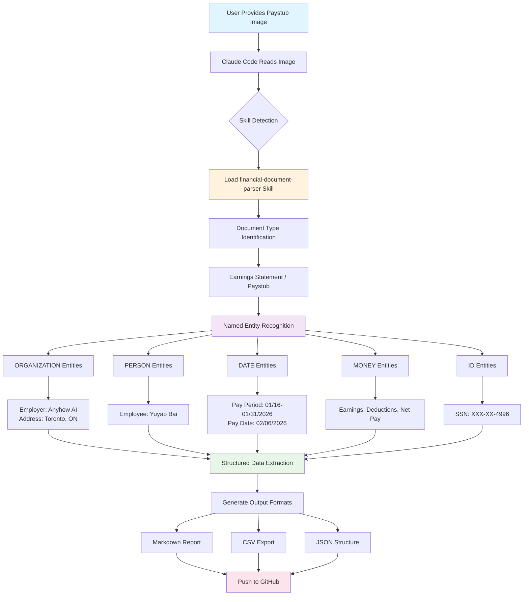

# Canadian Paystub NER Tagging Demo with Claude Code

This project demonstrates how **Claude Code** (Anthropic's CLI for Claude) can be used to extract and tag information from financial documents using Named Entity Recognition (NER).

## Process Flowchart



## What is Claude Code?

[Claude Code](https://docs.anthropic.com/en/docs/claude-code) is Anthropic's official CLI tool that brings Claude's AI capabilities directly to your terminal. It can:
- Read and analyze files (including images)
- Execute commands
- Write and edit code
- Use specialized "skills" for domain-specific tasks

## Skills Used

### 1. Financial Document Parser Skill
A specialized skill that extracts structured data from financial documents with automatic categorization and analysis.

**Skill Location:** `.claude/skills/financial-document-parser/SKILL.md`

**Capabilities:**
- Identify document types (invoices, receipts, statements, paystubs)
- Extract core financial information
- Categorize expenses
- Generate structured output in multiple formats

### 2. Built-in Vision/OCR
Claude Code's multimodal capabilities allow it to directly read and interpret images, including:
- Text extraction from images
- Understanding document layouts
- Recognizing financial data patterns

## The Process

### Step 1: Skill Installation
```bash
mkdir -p .claude/skills/financial-document-parser
# Download and extract skill
```

### Step 2: Image Analysis
Claude Code reads the paystub image using its multimodal vision capabilities. No external OCR tool is needed - Claude can directly interpret the image content.

### Step 3: Document Type Identification
The financial-document-parser skill identifies the document as an **Earnings Statement (Paystub)** from Canada.

### Step 4: Named Entity Recognition (NER)
Claude extracts and tags entities into categories:

| Entity Type | Examples Extracted |
|-------------|-------------------|
| **ORGANIZATION** | Anyhow AI, 81 Wellesley Street East, Toronto, ON |
| **PERSON** | Yuyao Bai |
| **DATE** | 01/16/2026, 01/31/2026, 02/06/2026 |
| **MONEY** | $4,166.67, $2,894.29, $12,500.67, etc. |
| **ID** | XXX-XX-4996 (SSN masked) |

### Step 5: Structured Data Generation
Output is generated in three formats:
- **Markdown** (`paystub_analysis.md`) - Human-readable report
- **CSV** (`paystub_analysis.csv`) - Spreadsheet-compatible flat data
- **JSON** (`paystub_analysis.json`) - Structured hierarchical data

## Files in This Repository

| File | Description |
|------|-------------|
| `sample_paystub.png` | Original Canadian paystub image |
| `paystub_analysis.md` | Markdown analysis report |
| `paystub_analysis.csv` | CSV export with NER tags |
| `paystub_analysis.json` | JSON structured data |
| `flowchart.md` | Mermaid flowchart source |
| `README.md` | This documentation |

## Sample Extracted Data

### Financial Summary
| Category | Current | Year to Date |
|----------|---------|--------------|
| Gross Pay | $4,166.67 | $12,500.67 |
| Deductions | $1,272.38 | $3,817.14 |
| Net Pay | $2,894.29 | $8,683.53 |

### Deductions Breakdown (YTD)
- Federal CPP: $717.72
- Federal EI: $203.76
- Canada Income Tax: $1,954.77
- Ontario Provincial Tax: $940.89

## Insights Generated
- Pay frequency: Semi-monthly
- Estimated annual salary: ~$100,000 CAD
- Effective tax rate YTD: ~30.5%
- Jurisdiction: Ontario, Canada

## How to Reproduce

1. Install Claude Code:
   ```bash
   npm install -g @anthropic-ai/claude-code
   ```

2. Install the financial-document-parser skill (or create your own)

3. Provide a financial document image to Claude Code

4. Ask Claude to extract and tag the information:
   ```
   "Extract information from this paystub, tag entities, and export to JSON/CSV/Markdown"
   ```

## License

This is a demonstration project. The paystub shown is a sample/mock document.

---

*Generated with [Claude Code](https://claude.com/claude-code) powered by Claude Opus 4.5*
