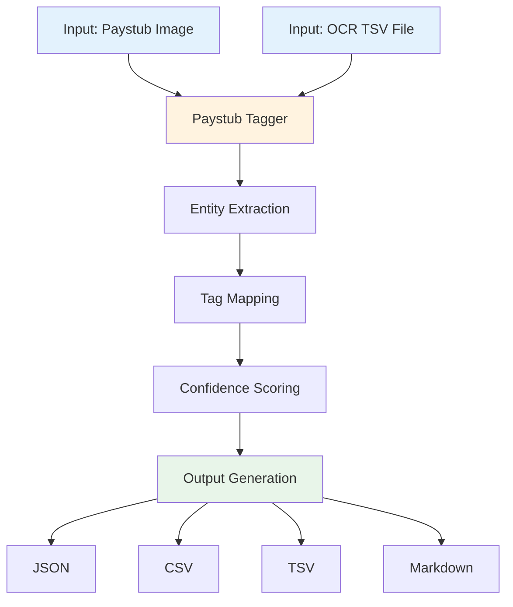

# Canadian Paystub NER Tagging Demo with Claude Code

This project demonstrates how **Claude Code** (Anthropic's CLI for Claude) can be used to extract and tag information from financial documents using Named Entity Recognition (NER).

## Features

- **Image + OCR Input**: Takes paystub image and OCR TSV file as inputs
- **Standard Tag Schema**: Uses consistent paystub entity tags
- **Multiple Output Formats**: JSON, CSV, TSV, Markdown
- **Confidence Scores**: Provides extraction confidence for each tag

## Tag Schema

The following standardized tags are used for paystub NER:

| Tag | Description |
|-----|-------------|
| `EMPLOYER_COMPANY_NAME` | Name of the employer/company |
| `EMPLOYEE_NAME` | Name of the employee |
| `PAY_PERIOD_START_DATE` | Start date of pay period |
| `PAY_PERIOD_END_DATE` | End date of pay period |
| `PAY_DATE` | Date of payment |
| `REGULAR_PAY_AMOUNT` | Regular earnings amount |
| `GROSS_PAY_YTD` | Year-to-date gross pay |
| `GROSS_PAY_CURRENT` | Current period gross pay |
| `NET_PAY_YTD` | Year-to-date net pay |
| `NET_PAY_CURRENT` | Current period net pay |
| `DEDUCTION_YTD` | Year-to-date deductions |
| `DEDUCTION_CURRENT` | Current period deductions |
| `EMPLOYEE_ADDRESS` | Employee's address |
| `COMPANY_ADDRESS` | Employer's address |

## Usage

### Command Line

```bash
python paystub_tagger.py --image <image_path> --ocr <ocr.tsv> --output <output_base>
```

### Options

| Option | Short | Description | Required |
|--------|-------|-------------|----------|
| `--image` | `-i` | Path to paystub image | Yes |
| `--ocr` | `-o` | Path to OCR TSV file | Yes |
| `--output` | `-out` | Output filename base (no extension) | No (default: tagged_output) |
| `--format` | `-f` | Output formats: json, csv, tsv, md, all | No (default: all) |

### Example

```bash
python paystub_tagger.py -i sample_paystub.png -o sample_ocr.tsv -out tagged_paystub -f all
```

## Input Files

### Image File
Any standard image format (PNG, JPG, etc.) containing the paystub.

### OCR TSV File
Tab-separated file with OCR results. Expected columns:
- `text`: Extracted text
- `x`, `y`: Bounding box position
- `width`, `height`: Bounding box dimensions
- `confidence`: OCR confidence score

Example:
```tsv
text	x	y	width	height	confidence
Anyhow AI	50	30	150	25	0.98
Yuyao Bai	50	145	100	20	0.96
```

## Output Files

### JSON (`tagged_paystub.json`)
Structured data with tags, values, and confidence scores.

### CSV (`tagged_paystub.csv`)
Flat format for spreadsheet import.

### TSV (`tagged_paystub.tsv`)
Tab-separated format for annotation tools.

### Markdown (`tagged_paystub.md`)
Human-readable report with tables.

## Process Flowchart



## Sample Results

From `sample_paystub.png`:

| Tag | Value | Confidence |
|-----|-------|------------|
| EMPLOYER_COMPANY_NAME | Anyhow AI | 98% |
| EMPLOYEE_NAME | Yuyao Bai | 96% |
| PAY_PERIOD_START_DATE | 01/16/2026 | 95% |
| PAY_PERIOD_END_DATE | 01/31/2026 | 95% |
| PAY_DATE | 02/06/2026 | 97% |
| REGULAR_PAY_AMOUNT | $4,166.67 | 96% |
| GROSS_PAY_YTD | $12,500.67 | 96% |
| GROSS_PAY_CURRENT | $4,166.67 | 96% |
| NET_PAY_YTD | $8,683.53 | 96% |
| NET_PAY_CURRENT | $2,894.29 | 97% |
| DEDUCTION_YTD | $3,817.14 | 96% |
| DEDUCTION_CURRENT | $1,272.38 | 96% |
| COMPANY_ADDRESS | 81 Wellesley Street East, Toronto, ON M4Y 0C5 | 95% |

## Files in This Repository

| File | Description |
|------|-------------|
| `paystub_tagger.py` | Main tagger script |
| `sample_paystub.png` | Sample Canadian paystub image |
| `sample_ocr.tsv` | Sample OCR output |
| `tagged_paystub.json` | JSON output |
| `tagged_paystub.csv` | CSV output |
| `tagged_paystub.tsv` | TSV output |
| `tagged_paystub.md` | Markdown output |

## Requirements

- Python 3.7+
- No external dependencies (uses standard library only)

## License

This is a demonstration project. The paystub shown is a sample/mock document.

---

*Generated with [Claude Code](https://claude.com/claude-code) powered by Claude Opus 4.5*
