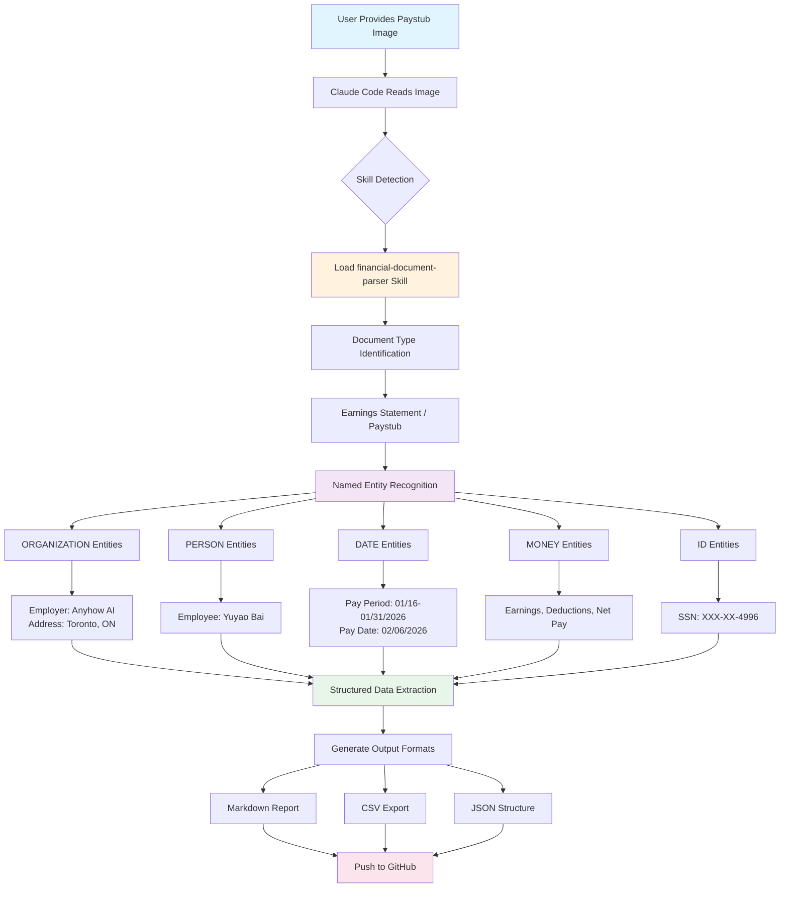

```mermaid
flowchart TD
    A[User Provides Paystub Image] --> B[Claude Code Reads Image]
    B --> C{Skill Detection}
    C --> D[Load financial-document-parser Skill]
    D --> E[Document Type Identification]
    E --> F[Earnings Statement / Paystub]

    F --> G[Named Entity Recognition]

    G --> H1[ORGANIZATION Entities]
    G --> H2[PERSON Entities]
    G --> H3[DATE Entities]
    G --> H4[MONEY Entities]
    G --> H5[ID Entities]

    H1 --> I[Employer: Anyhow AI<br/>Address: Toronto, ON]
    H2 --> J[Employee: Yuyao Bai]
    H3 --> K[Pay Period: 01/16-01/31/2026<br/>Pay Date: 02/06/2026]
    H4 --> L[Earnings, Deductions, Net Pay]
    H5 --> M[SSN: XXX-XX-4996]

    I & J & K & L & M --> N[Structured Data Extraction]

    N --> O[Generate Output Formats]
    O --> P1[Markdown Report]
    O --> P2[CSV Export]
    O --> P3[JSON Structure]

    P1 & P2 & P3 --> Q[Push to GitHub]

    style A fill:#e1f5fe
    style D fill:#fff3e0
    style G fill:#f3e5f5
    style N fill:#e8f5e9
    style Q fill:#fce4ec
```
